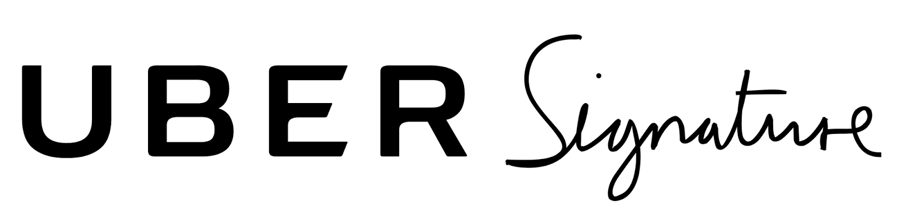
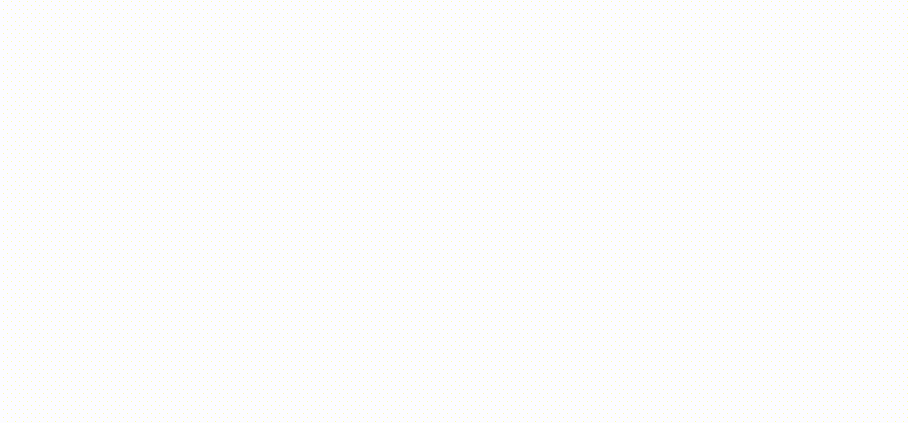

Swift version now available!

Mimicking pen-on-paper signatures with a touch screen presents a difficult set of challenges.

The rate touch events are emitted does not provide enough information to mimick the same smooth line the user made with their finger. Simply drawing straight lines between the touch points will yield an unnatural looking line made of discrete sections - especially when the user is moving their finger fast, as the number of touch events stays constant, providing even fewer points per unit of distance moved.

Touches are also collected on the main thread, so any bottleneck on the main thread can adversely affect the frequency with which touches are collected.

Real pen-on-paper signatures vary in line thickness, related to the speed the pen is moved and how hard/soft it is applied to paper. Emulating this requires the use of a more complex drawing routine invloving calculating shapes rather than a line of set weight simply plotted between the touch points.

With UberSignature, we attempted to engineer a solution that feels responsive and produces realistic looking signatures. The implementation separates responsiblities across multiple classes, making the logic easier to understand and maintain. The core algorithm is also written synchronously so its execution can be easily followed. A wrapping class then encapsulates this and provides it asynchronously.

The package provides a SignatureDrawingViewController that detects the touches and draws a signature-styled line as the user moves their finger. It provides the ability to instantiate with a previous image, get current signature image, reset, and change signature color. It can be presented at any size and resizing the view will update the signature accordingly, allowing it to be used in auto-layout environments with ease.

### To use:

Instantiate a SignatureDrawingViewController, optionally with an image that will be the starting signature.

ObjC:
```
[[UBSignatureDrawingViewController alloc] initWithImage:image];
```

Swift:
```
SignatureDrawingViewController(image: image)
```

The view controller can either be presented directly or added as a child view controller. The view can be positioned using auto-layout or the frame set to any needed size. The backing signature image will resize to fit.


